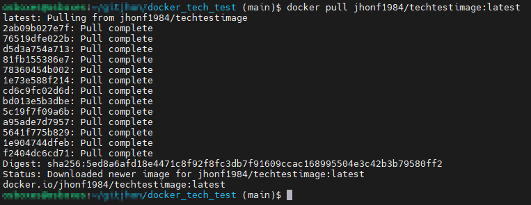
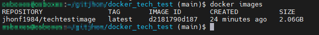
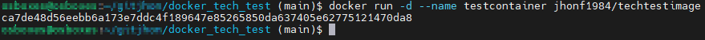
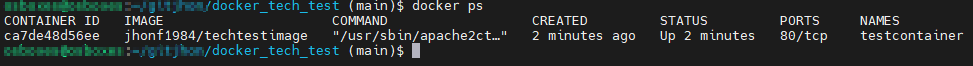
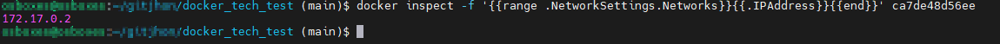
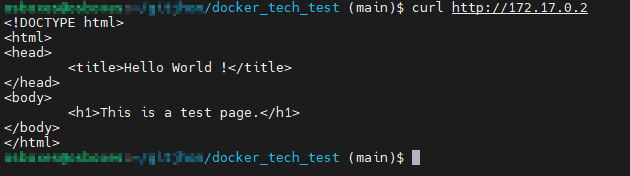
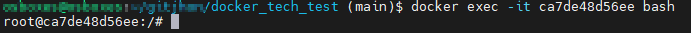
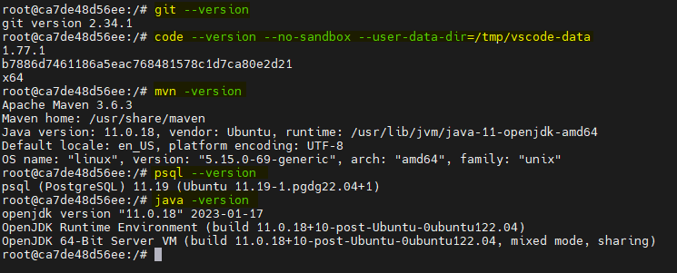

# docker_tech_test
Build a Docker image that pulls up a Virtual machine on Linux with the following specifications:
- Install Git
- Install Vs Code
- Install Maven
- Install PostgreSQL
- Install Java JRE
- Must be able to compile NetCore projects
- Must be able to compile Java applications
- Upload an apache server with a "hello world" or any public project.
It must be created in your own account (you must explore your options) and once the image is finished, validate if it is possible to give us access for the review and send the Docker file.

In this repository you will find the deliverables required for this technical test, as follows:
- Dockerfile.
- Url to download the image from Docker Hub.

<b>INSTRUCTIONS TO TEST THE DOCKERFILE</b>

1. Open a terminal in a Linux machine where you have docker installed.

2. Download the image from Docker Hub in a linux machine with this command: docker pull jhonf1984/techtestimage:latest

3. Run docker images to check if the image is available. 

4. Run the image: docker run -d --name testcontainer jhonf1984/techtestimage

5. Check if the container is running. Execute docker ps and look for the testcontainer id.

6. Check the container Ip address to test the hello world page: 
   `docker inspect -f '{{range .NetworkSettings.Networks}}{{.IPAddress}}{{end}} <container id>`
   
    
7. Test the hello world page: curl http://<ip from step 3.> .  You will see the hello world page code.

    
8. Get into the container to verify all required software is installed: docker exec -it <containerId> bash

    
9. To check the required software installation:
    - For Git, run: git --version
    - For Vs Code, run: code --version --no-sandbox --user-data-dir=/tmp/vscode-data
    - For Maven, run: mvn -version
    - For PostgreSQL, run: psql --version
    - For Java JRE, run: java -version

